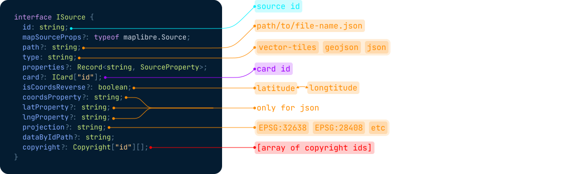
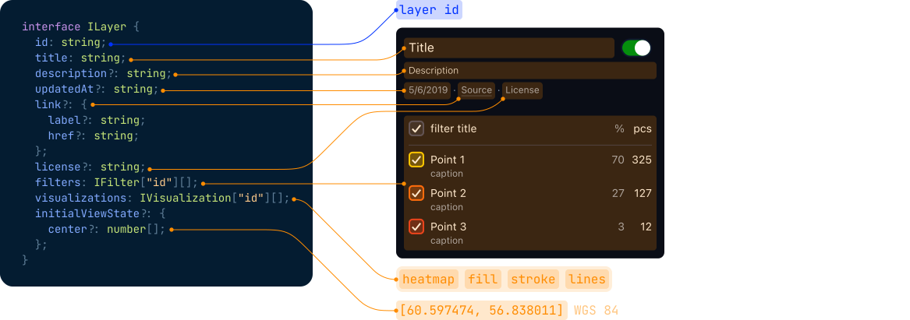
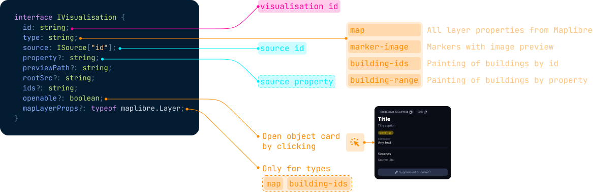
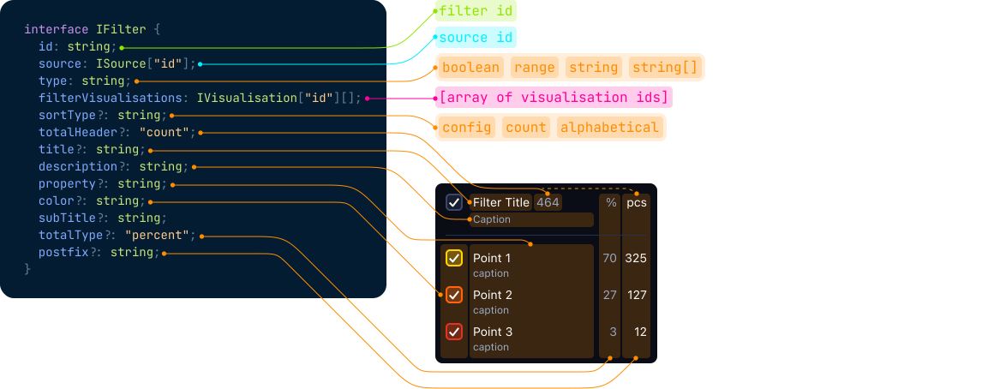
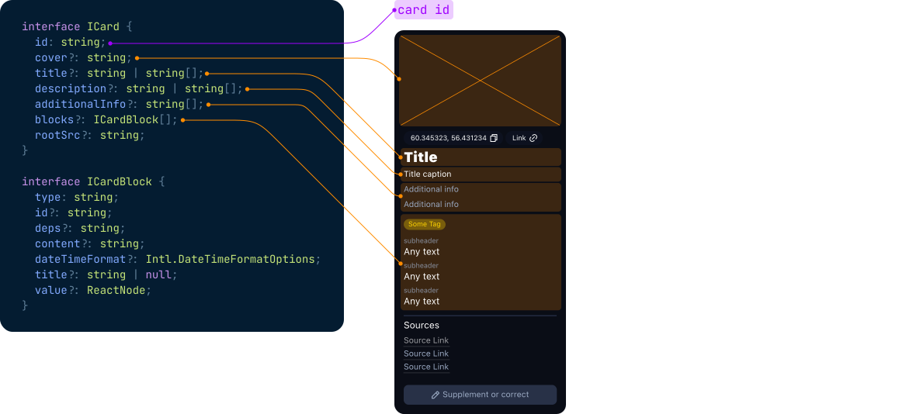

Set up a beautiful geoportal using config. No code.

**Features**

1. All features from mapbox \ maplibre \ deck.gl
2. JSON configuration (can be stored on the backend)
3. Custom geojson & vector tiles filters
4. Custom geojson & vector tiles visualisation
5. License, copyright and metadata management
6. Low level api via redux actions
7. Custom files loader
8. Custom projections
9. Built-in responsive version
10. Pmtiles support
11. Basemap setup
12. Themes
13. Localisation
14. Terrain
15. Countours
16. Typescript-safe

# Tldr;

Main details:

1. Library is a maplibre map wrapper.
2. You can use any features from mapbox \ maplibre \ deck.gl
3. Library has 5 main entities: sources, layers, visualization, filter, card
4. Source: data source (geojson, json, vector tile), technically is a wrapper for mabplibre Source with extra params
5. Visualization: wrapper for the mabplibre Layer with extra params.
6. Filter: configuration for custom ui that helps to filter source data
7. Layer: group of visualizations and filters
8. Card: popup for selected data

# Installation

```typescript
npm i sloy-map
npm i react-redux @reduxjs/toolkit
```

```typescript
import { Provider } from "react-redux";
import { configureStore } from "@reduxjs/toolkit";
import { SloyMap, sloyReducer } from "sloy-map";

const store = configureStore({
  reducer: {
    sloy: sloyReducer,
  },
});


// full basic example in the example/ folder
<Provider store={store}>
  <SloyMap
    mapState={{
      initialViewState: {
        zoom: 14.5,
        longitude: 44.51,
        latitude: 40.18,
      },
      mapStyle: "https://sloy.io/armenia/style.json",
    }}
    sources=[
      {
          id: "sourceId",
          path: "/file.geojson",
          type: "geojson",
          // also you can use { type: "json" }
          // with latProperty, lngProperty, coordsProperty, isCoordsReverse for custom lat\lng keys

          // you can use custom projection here
          // supports proj4 format
          projection: "EPSG:28408",
          properties: [
            {
              id: "VALUE",
              title: "kcal/cm²",
              // you can describe data colors here, this colors can be used in the visualisations and filters
              values: {
                40: { color: "#fddede" },
                45: { color: "#feb7b9" },
                50: { color: "#fd9793" },
              },
            },
            {
              id: "UNIT",
              title: "Units",
            },
          ],
          // you can describe popup content using the keys from the data
          card: {
            title: "name",
            blocks: [{ type: "value", id: "VALUE" }],
          },
          mapSourceProps: {
            /* any mapbox\maplibre source props */
          }
        }
    ],
    layers={[
      {
          title: "Geojson example",
          description: "Description",
          visualizations: [
            {
              id: "visualizationId",
              source: "sourceId",
              openable: true,
              property: "VALUE",
              type: "map",
              // any mapbox\maplibre props:
              mapLayerProps: {
                type: "fill",
                paint: {
                  "fill-opacity": 0.6,
                },
              },
            },
          ],
        }
    ]}
    mapProps={{
      /* you can use mapbox\maplibre map props here
         for example mapboxAccessToken: xxxx */
    }}
  />
</Provider>
```

You can find more examples in the src/examples/ folder

# API

## Map props

```typescript
export interface SloyMapProps extends MapContextProps {
  mapState: IMapState;
  mapProps?: IMapProps;
  sources: InputSloySource[];
  layers: InputSloyLayer[];
  theme?: typeof styled-components ThemeProvider;
  copyrights?: ICopyright[];
  children?: ReactNode;
  locale?: string;
  translations?: Record<string, Record<string, string>>;
  overrideCard?: OverrideCardFn;
  overrideLayers?: OverrideLayersFn;
  terrainSource?: string;
  layout?: {
    hasBaseMap?: boolean;
    hasPmtiles?: boolean;
    buildingLayerName?: string;
    loaderImageSrc?: string;
    canSelectMultipleLayers?: boolean;
  };
}
```

## Source

```typescript
interface ISource {
  id: string;
  mapSourceProps?: typeof maplibre.Source;
  // path to file
  path?: string;
  type: "vector-tiles" | "geojson" | "json";
  properties?: Record<string, SourceProperty>;
  card?: ICard["id"];
  isCoordsReverse?: boolean;
  coordsProperty?: string;
  latProperty?: string;
  lngProperty?: string;
  projection?: string;
  dataByIdPath?: string;
  copyright: Copyright["id"][];
}
```



## Layer

```typescript
interface ILayer {
  id: string;
  title: string;
  filters: IFilter["id"][];
  visualizations: IVisualization["id"][];
  updatedAt?: string;
  subTitle?: string;
  initialViewState?: {
    center?: number[];
  };
  description?: string;
  license?: string;
  link?: {
    label?: string;
    href?: string;
  };
}
```



### Visualization

```typescript
interface IVisualization {
  id: string;
  type: "map" | "building-ids" | "marker-image" | "building-range";
  source: ISource["id"];
  property?: string;
  previewPath?: string;
  rootSrc?: string;
  ids?: string[];
  openable?: boolean;
  mapLayerProps?: typeof maplibre.Layer;
}
```



### Filter

```typescript
interface IFilter {
  id: string;
  source: ISource["id"];
  type: "boolean" | "range" | "string" | "string[]";
  filterVisualizations: IVisualization["id"][];
  sortType?: "config" | "count" | "alphabetical";
  title?: string;
  description?: string;
  color?: string;
  property?: string;
  subTitle?: string;
  postfix?: string;
  totalType?: "percent";
  totalHeader?: "count";
}
```



### Card

```typescript
interface ICard {
  id: string;
  title?: string | string[];
  description?: string | string[];
  additionalInfo?: string[];
  blocks: ICardBlock[];
  cover?: string;
  rootSrc?: string;
}

interface ICardBlock {
  type: string;
  id?: string;
  deps?: string;
  content?: string;
  dateTimeFormat?: Intl.DateTimeFormatOptions;
  title?: string | null;
  value?: ReactNode;
}
```



### Copyright

```typescript
interface ICopyright {
  id: string;
  shortName: string;
  fullName?: string;
  url: string;
  requiredAttribution?: boolean;
}
```


## Contribution

```typescript
pnpm i
pnpm start
```
